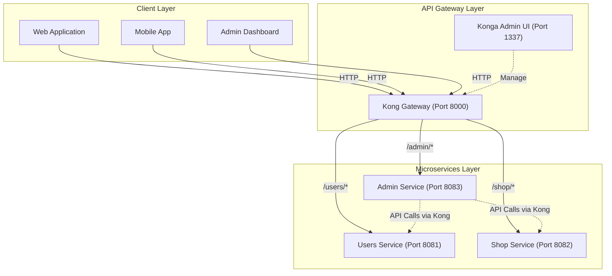

# GameGear E-commerce Backend


ระบบหลังบ้านสำหรับแพลตฟอร์ม **GameGear E-commerce** พัฒนาด้วยสถาปัตยกรรม **Microservices** โดยใช้ภาษา Go (Gin Framework) และใช้ **Kong API Gateway (DB Mode)** เป็นจุดทางเข้าเดียว (Single Entry Point) สำหรับการบริหารจัดการ Traffic, Routing, Authentication (JWT), Rate Limiting และ CORS

---

## 1. System Architecture Overview

ระบบออกแบบตามหลักการ **3-Tier Architecture** เพื่อรองรับการขยายตัว (Scalability) และแยกขอบเขตความรับผิดชอบอย่างชัดเจน (Separation of Concerns):


```mermaid
graph TB
    subgraph Client_Layer ["Client Layer"]
        WEB["Web Application"]
        MOBILE["Mobile App"]
        ADMIN_UI["Admin Dashboard"]
    end

    subgraph Gateway_Layer ["API Gateway Layer"]
        KONG["Kong Gateway (Port 8000)"]
        KONGA["Konga Admin UI (Port 1337)"]
    end

    subgraph Microservices_Layer ["Microservices Layer"]
        USERS["Users Service (Port 8081)"]
        SHOP["Shop Service (Port 8082)"]
        ADMIN["Admin Service (Port 8083)"]
    end

    WEB -->|HTTP| KONG
    MOBILE -->|HTTP| KONG
    ADMIN_UI -->|HTTP| KONG

    KONGA -.->|Manage| KONG

    KONG -->|/users/*| USERS
    KONG -->|/shop/*| SHOP
    KONG -->|/admin/*| ADMIN

    ADMIN -.->|API Calls via Kong| USERS
    ADMIN -.->|API Calls via Kong| SHOP
```

### Core Components
- **Client Layer**: ผู้ใช้ทั่วไปและผู้ดูแลระบบส่งคำขอ HTTP เข้าสู่ระบบ
- **Kong Gateway (Proxy :8000)**: ทำหน้าที่เป็น Reverse Proxy คัดกรองและส่งต่อคำขอไปยังบริการภายใน
- **Konga UI (:1337)**: แดชบอร์ดสำหรับการจัดการ Routing และ Plugins ของ Kong Gateway
- **Microservices Layer**: ประกอบด้วย 3 บริการอิสระที่สื่อสารกันผ่าน Gateway

> รายละเอียดเชิงลึกเกี่ยวกับสถาปัตยกรรมและกลไกความปลอดภัย สามารถศึกษาเพิ่มเติมได้ที่ [docs/architecture.md](docs/architecture.md)

---

## 2. Microservices Directory

| Service | Port | Repository Folder | หน้าที่หลัก |
| :--- | :---: | :--- | :--- |
| **Users Service** | `8081` | [`users-service`](users-service/README.md) | ระบบสมาชิก, การยืนยันตัวตน, จัดการสิทธิ์ และการออก JWT Token |
| **Shop Service** | `8082` | [`shop-service`](shop-service/README.md) | จัดการข้อมูลสินค้า, หมวดหมู่, ตะกร้าสินค้า และคำสั่งซื้อ |
| **Admin Service** | `8083` | [`admin-service`](admin-service/README.md) | ผู้ประสานงาน (Coordinator) สำหรับระบบหลังบ้านของแอดมิน |

---

## 3. Quick Start

### 3.1 เริ่มต้น Kong Gateway & Konga UI
โครงสร้างพื้นฐานของ Gateway ถูกกำหนดไว้ในรูปแบบ Docker Compose:

```bash
cd admin-service
docker compose -f docker-compose.kong.yml up -d
```

### 3.2 รัน Microservices บน Local
เปิดแต่ละ Service ใน Terminal แยกกัน:

```bash
# Users Service
cd users-service && go run cmd/api/main.go

# Shop Service
cd shop-service && go run cmd/api/main.go

# Admin Service
cd admin-service && go run cmd/api/main.go
```

> ขั้นตอนการติดตั้งอย่างละเอียด การตั้งค่า Environment Variables และการใช้งาน ngrok ดูได้ที่ [docs/getting-started.md](docs/getting-started.md)

---

## 4. Documentation Index

เอกสารเชิงลึกทั้งหมดถูกจัดเก็บไว้ในโฟลเดอร์ [`docs/`](docs/) เพื่อความเป็นระเบียบและง่ายต่อการสืบค้น:

- [docs/architecture.md](docs/architecture.md) — สถาปัตยกรรมระบบ, การสื่อสารข้าม Service, และ Authentication Flow
- [docs/getting-started.md](docs/getting-started.md) — คู่มือเตรียมสภาพแวดล้อม การรันระบบเบื้องต้น และการร่วมพัฒนากับทีม
- [docs/gateway-configuration.md](docs/gateway-configuration.md) — ขั้นตอนการเชื่อมต่อ Konga, การสร้าง Services & Routes, และการเปิดใช้ Plugins
- [docs/api-reference.md](docs/api-reference.md) — รายการ API Endpoints ทั้งหมดพร้อมตัวอย่าง Request Payload
- [docs/project-resources.md](docs/project-resources.md) — รวบรวมลิงก์เอกสารส่งงานของกลุ่ม และแหล่งอ้างอิงทางเทคนิค

---

## 5. Development Team

| Profile | ชื่อ-นามสกุล | หน้าที่และความรับผิดชอบ | GitHub |
| :---: | :--- | :--- | :---: |
|  | **วรรธนโรจน์ บุตรดี** | Project Manager & Admin Service Developer | [@Wattanaroj2567](https://github.com/Wattanaroj2567) |
|  | **ณัฐพงษ์ ดีบุตร** | Backend Developer (Shop Service) | [@Natthaphong66](https://github.com/Natthaphong66) |
|  | **ณิชพน มานิตย์** | Backend Developer (Users Service) | [@nitchapon66](https://github.com/nitchapon66) |
|  | **วายุ กอคูณ** | Backend Developer (Shop Service) | [@FUJIKOTH](https://github.com/FUJIKOTH) |
