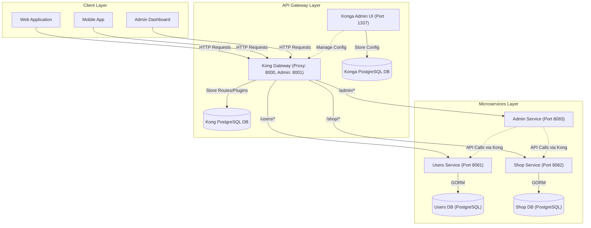
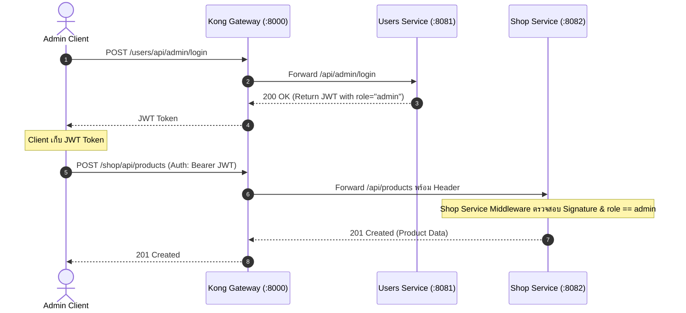

# System Architecture

เอกสารนี้อธิบายรายละเอียดเชิงลึกเกี่ยวกับสถาปัตยกรรมของระบบ **GameGear E-commerce** ซึ่งพัฒนาด้วยแนวทาง Microservices Architecture โดยมี Kong API Gateway เป็นจุดศูนย์กลางในการจัดการคำขอและการรักษาความปลอดภัย

---

## 1. Overview & Tier Design

ระบบแบ่งการทำงานออกเป็น 3 ระดับหลัก (3-Tier Architecture):

### 1.1 Client Layer
- **Web Application / Mobile App**: เข้าถึงบริการต่างๆ ของระบบ เช่น การค้นหาสินค้า สั่งซื้อ และจัดการบัญชีผู้ใช้
- **Admin Dashboard**: หน้าจอสำหรับการบริหารจัดการข้อมูลสินค้า ผู้ใช้ และสถานะคำสั่งซื้อ

### 1.2 API Gateway Layer
- **Kong Gateway**: จุดทางเข้าเดียว (Single Entry Point) สำหรับการเข้าถึงระบบหลังบ้านทั้งหมด จัดการ Routing, Rate Limiting, CORS, และ Forwarding Authentication Headers
- **Konga UI**: ส่วนประสานงานผู้ใช้แบบกราฟิก (GUI) สำหรับจัดการคอนฟิกของ Kong Gateway
- **Gateway Databases**: ฐานข้อมูล PostgreSQL แยกอิสระสำหรับจัดเก็บ State และ Plugin Configuration ของ Kong และ Konga

### 1.3 Microservices Layer
- **Users Service**: รับผิดชอบการจัดการข้อมูลผู้ใช้, สิทธิ์การเข้าถึง, การลงทะเบียน, ล็อกอิน และการออก JWT Token
- **Shop Service**: รับผิดชอบการจัดการแคตตาล็อกสินค้า, ตะกร้าสินค้า, และคำสั่งซื้อ
- **Admin Service**: ทำหน้าที่เป็น Coordinator (Admin Gateway) จัดเตรียม API สำหรับ Admin Dashboard โดยเรียกต่อไปยัง Users Service และ Shop Service ผ่าน Kong Gateway โดยไม่ถือครองฐานข้อมูลโดยตรง

---

## 2. Gateway Architecture: DB Mode vs DB-less

โปรเจกต์นี้เลือกใช้ **Kong Gateway ในโหมด Database (DB Mode)** ร่วมกับ PostgreSQL และ Konga UI ด้วยเหตุผลดังนี้:

| หัวข้อการเปรียบเทียบ | DB Mode + Konga UI (เลือกใช้) | DB-less Mode (Declarative YAML) |
| :--- | :--- | :--- |
| **การจัดการผ่าน GUI** | มี Konga UI สำหรับดูสถานะและคอนฟิกผ่านเว็บ | ไม่มี GUI ต้องแก้ไขผ่านไฟล์ YAML |
| **ความยืดหยุ่นในการอัปเดต** | อัปเดต Services/Routes/Plugins ได้ทันทีโดยไม่ต้อง Restart Gateway | ต้อง Reload Configuration ทุกครั้งเมื่อแก้ไฟล์ |
| **การทำงานร่วมกันในทีม** | สมาชิกในทีมสามารถปรับเปลี่ยน Routing หรือทดสอบได้พร้อมกัน | ต้องประสานงานผ่าน Git และ CI/CD Pipeline |
| **ความเหมาะสม** | เหมาะสำหรับช่วง Development และระบบที่มีการปรับเปลี่ยน Route บ่อยครั้ง | เหมาะสำหรับ Production ที่เน้น Immutable Infrastructure และ GitOps |

---

## 3. Data Isolation & Service Communication

1. **Database-per-Service**:
   - แต่ละ Service ที่มีฐานข้อมูล (`users-service`, `shop-service`) จะครอบครองฐานข้อมูลของตนเองโดยสมบูรณ์
   - ไม่อนุญาตให้ Service อื่นเชื่อมต่อตรงไปยังฐานข้อมูลข้าม Service ข้อมูลทุกชนิดต้องเข้าถึงผ่าน REST API เท่านั้น
2. **Synchronous Communication**:
   - Client เรียกผ่าน Kong Proxy (`http://localhost:8000`)
   - `admin-service` สื่อสารกับ `users-service` และ `shop-service` โดยส่ง HTTP Request ย้อนกลับเข้าทาง Kong Gateway เพื่อให้ผ่านกฎ Routing, Logging และ Rate Limiting เสมอ

---

## 4. Authentication & Authorization Flow

ระบบใช้กลไก Stateless Authentication ด้วย JSON Web Token (JWT) โดยมีข้อกำหนดสำคัญดังนี้:

- **Centralized Credential Store**: ข้อมูล Credential ทั้งหมด (ทั้งสมาชิกทั่วไปและแอดมิน) ถูกเก็บและตรวจสอบโดย `users-service` เท่านั้น
- **Role-Based Token Claims**: JWT Token มีการระบุ Claim `role` (เช่น `role: "member"` หรือ `role: "admin"`)
- **Shared Secret Key**: Services ที่ต้องตรวจสอบสิทธิ์เบื้องหลัง (เช่น `shop-service`) และ `users-service` มีการตั้งค่า `JWT_SECRET_KEY` ที่ตรงกัน เพื่อให้สามารถ Verify ลายเซ็นของ Token ได้โดยไม่ต้องเรียกถาม `users-service` ซ้ำ
- **Admin Proxy Flow**: `admin-service` ไม่เก็บรหัสผ่านหรือข้อมูลการยืนยันตัวตน แต่ทำหน้าที่ส่งคำขอต่อไปยัง `users-service` เพื่อรับ Token แล้วส่งกลับให้ Admin Client

---

## 5. Port Allocations & Network Topology

| บริการ / องค์ประกอบ | Port | โหมดการเข้าถึง | หน้าที่ |
| :--- | :---: | :--- | :--- |
| **Kong Proxy** | `8000` | สาธารณะ / ภายนอก | จุดรับ HTTP Request หลักของระบบ |
| **Kong Admin API** | `8001` | ภายใน (Development) | API สำหรับจัดการการตั้งค่า Kong |
| **Konga Admin UI** | `1337` | เว็บบราวเซอร์ | แดชบอร์ดจัดการ Kong Gateway |
| **Users Service** | `8081` | ภายใน / ผ่าน Kong | ให้บริการระบบสมาชิกและยืนยันตัวตน |
| **Shop Service** | `8082` | ภายใน / ผ่าน Kong | ให้บริการระบบสินค้าและคำสั่งซื้อ |
| **Admin Service** | `8083` | ภายใน / ผ่าน Kong | ให้บริการระบบประสานงานหลังบ้าน |
| **PostgreSQL (Kong)** | `5432` | เครือข่าย Docker | เก็บ State และ Plugins ของ Kong |
| **PostgreSQL (Konga)** | `5432` | เครือข่าย Docker | เก็บการตั้งค่าและบัญชีของ Konga |
| **PostgreSQL (Users)** | `5433` (หรือตาม .env) | เครือข่าย Service | เก็บตาราง `users`, `password_reset_tokens` |
| **PostgreSQL (Shop)** | `5434` (หรือตาม .env) | เครือข่าย Service | เก็บตาราง `products`, `carts`, `orders` |

> ในสภาพแวดล้อมจริงหรือการทดสอบแบบบูรณาการ การเรียกใช้งานทุก Service จาก Client ภายนอกจะต้องผ่าน **Kong Proxy (Port 8000)** เท่านั้น
